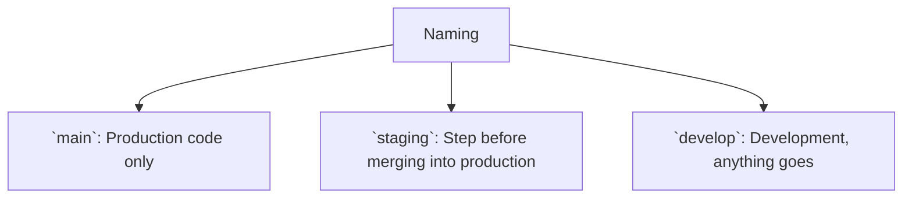
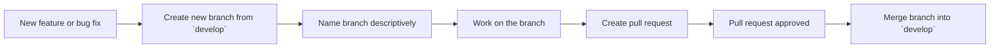
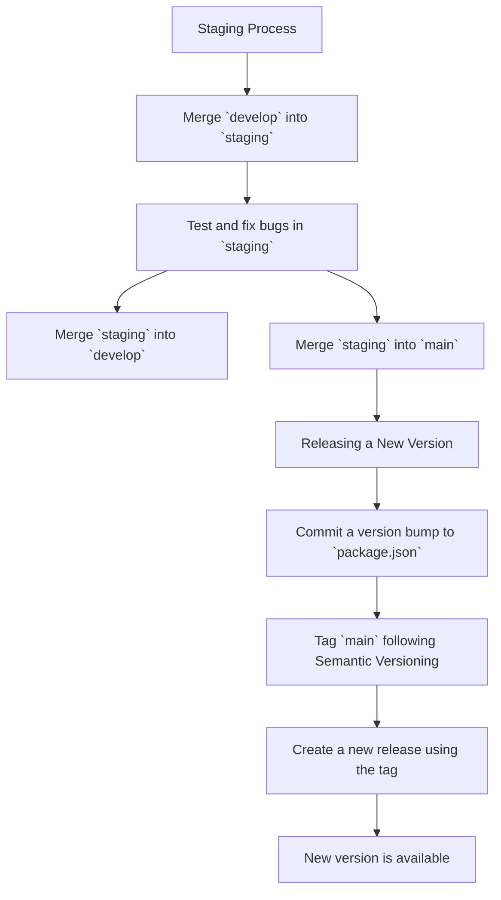

# Contributing

## Naming conventions

Some things you should know before cloning the repository and making changes:

- `main` is for production code only.
- `staging` is the pre-release branch tested before merging into production.
- `develop` is for development, anything goes. Pull requests should be made against this branch.



## Conventional commits

We follow and enforce the usage of [conventional commits](https://www.conventionalcommits.org/en/v1.0.0/#summary) for commit messages and pull requests titles.

PR titles are validated with the help of Github actions. More info [here](https://github.com/marketplace/actions/conventional-commit-in-pull-requests).

Commit messages are validated using a [Husky](https://typicode.github.io/husky/) `commit-msg` hook and [commitlint](https://commitlint.js.org/). More info [here](https://commitlint.js.org/guides/local-setup.html).

## Initial setup

1. Ensure `pnpm` is installed (https://pnpm.io/)
2. [Fork the repository](https://docs.github.com/en/pull-requests/collaborating-with-pull-requests/working-with-forks/fork-a-repo), then pull it down to your disk:

```bash
# Clone the repository
git clone git@github.com:YOUR_USERNAME/dAppBooster.git

# Change the directory
cd dAppBooster

# Checkout the development branch
git checkout develop

# Set the base repository as upstream (makes it easier to pull updates to your fork)
git remote add upstream git@github.com:BootNodeDev/dAppBooster.git

# Create a local .env file
cp .env.example .env.local

# Install the dependencies
pnpm i
```

## How'd you start a new feature, bug fix, etc.?

1. Find some issue you're interested in, a bug you want to fix, or a new feature you want to implement (make sure that no one else is already working on it!).

```bash
# Update your local copy of the develop branch with the latest code changes
git checkout develop
git pull -f upstream/develop

# Run pnpm i to get any dependency updates
pnpm i

# Create a new branch from develop. Give it a meaningful name (`feat/new-feature`, `fix/bug-fix`, `feature/#192`, etc.)
git checkout -b fix/something

# Work on the branch, commit your changes, push them... you know the drill.
# Finally, push the branch.
git push -u origin fix/something
```

2. Submit a pull request to the upstream dAppBooster repository.
3. Choose a descriptive title following the [conventional commits](https://www.conventionalcommits.org/en/v1.0.0/#summary) guidelines and write a detailed description of the changes you made using the PR template.
4. Wait for a maintainer to review your PR, make changes if asked, and get it merged.



## What about `staging`?

Once we reach a point where we feel like a new release is worth creating, we'll submit a pull request asking to merge `develop` into `staging`. This is the branch where things should be tested and fixed before merging into `main`. Consider it a pre-production environment.

We'll test `staging` thoroughly, fix all the (relevant) bugs and once everything is ready we will:

1. Merge `staging`'s fixes into `develop` so the development branch is up-to-date.
2. Submit a pull request asking to merge `staging` into `main`.

## And what about releases?

1. First, make sure the latest changes from `staging` are merged into `main`
2. Commit a version bump into the `package.json` file following Semantic Versioning's guidelines: https://semver.org/
3. Then tag `main` using the version set in the previous step.
4. Push the changes to `main`.
5. Create a new release using that tag.

That's it, everybody can see now that a new version is ready to use and if something's wrong they can go back to a previous version temporarily.


