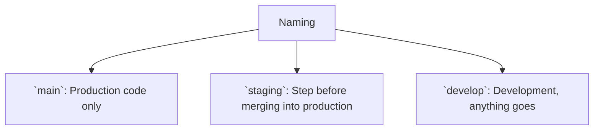
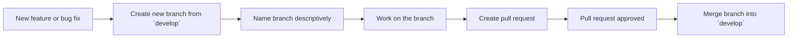
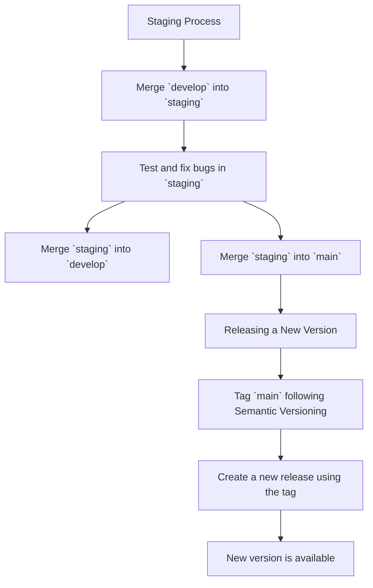

# Contributing workflow

## Naming conventions

- `main` is for production code only.
- `staging` is the step before merging into production.
- `develop` is for development. Anything goes.

## How'd you start a new feature, bug fix, etc.?

Create a new branch from `develop`, name your branch in some useful way (`feat/new-feature`, `fix/bug-fix`, `feature/#192`, etc.). Work on it until you're satisfied, and when you're done create a pull request. Once the pull request is approved and all the requirements are met, merge it into develop.

## What about `staging`?

Once you reach a point where you feel like a new release is worth creating, merge `develop` into `staging` This is the branch where things should be tested and fixed before merging into `main`

Test `staging` thoroughly, fix all the bugs (yeah, right!), and once everything's ready merge `staging`'s changes into `develop` (for further development) and `main` (to create a new release).

### And what now?

So, `staging` is ready and you merged it into `main`. Time for a new release!

First, tag `main` following Semantic Versioning's guidelines: https://semver.org/

After you created a new tag, create a new release using that tag. That's it, everybody now can see that a new version is ready to use and if something's wrong they can go back to using a previous version temporarily.

